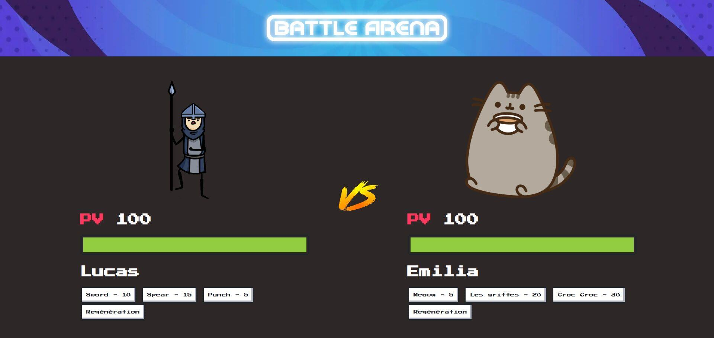
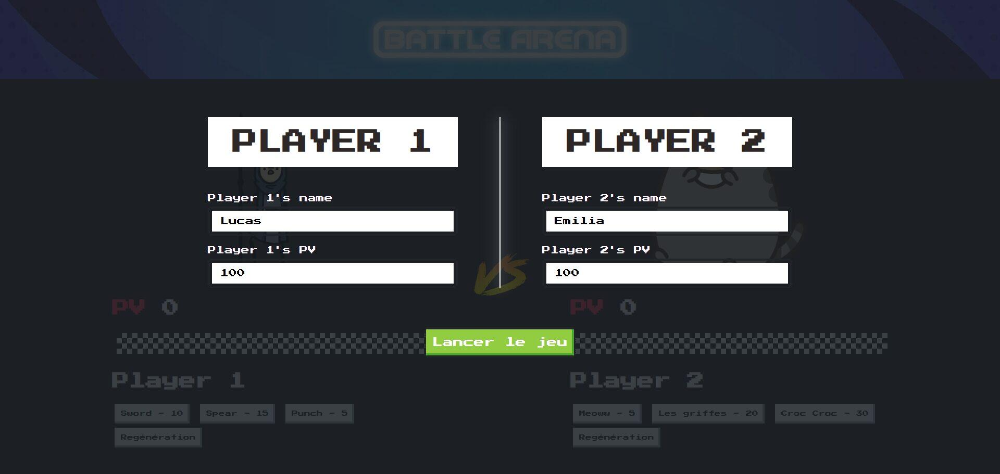

# BattleArena

> Jeu de combat web en duel au tour par tour, à deux joueurs sur le même clavier. JavaScript, jQuery, Sass et NES.css.

> Version réécrite en React, jouable sans rien installer : https://aboeka.fr/projects/battle-arena

## Captures

| | |
|---|---|
|  |  |
| L'écran de combat : barres de vie, coups et ambiance NES. | L'écran de configuration des deux joueurs avant le duel. |

## Contexte

Projet d'apprentissage réalisé en 2024 pendant ma formation Technicien Intégrateur Web (Buroscope). L'objectif : monter de zéro un jeu de combat jouable dans le navigateur, pour m'exercer à structurer du JavaScript en modules, à monter un pipeline Sass et à gérer des animations en temps réel.

Le principe : deux joueurs, un seul clavier. Chacun a son personnage, ses points de vie et ses coups (épée, lance, poing d'un côté ; griffes, crocs de l'autre). On frappe à tour de rôle, on peut se soigner au prix de son tour, et le premier tombé à zéro perd. Le tout dans une ambiance pixel arcade signée NES.css.

## Stack

- JavaScript et jQuery (logique de combat, tours, animations)
- Sass compilé en CSS (styles)
- NES.css (habillage rétro NES)
- npm (pipeline de build des styles)

## Statut

Ancien projet personnel, conservé en archive. Pas activement maintenu. Je le garde comme trace de mes étapes d'apprentissage avant l'ère des assistants IA. Une version réécrite proprement en React est jouable sur mon site, avec son guide et son onglet Méthode : https://aboeka.fr/projects/battle-arena

## Roadmap (si je devais le refaire aujourd'hui)

- Migrer le moteur vers Phaser 3 ou Pixi.js (sprite-sheets, hitboxes et audio natifs).
- Multijoueur en ligne via WebSocket (Socket.io ou Colyseus côté serveur).
- Adversaire piloté par une IA (Claude API) qui reçoit l'état du combat en JSON et choisit son action selon une persona configurable (agressif, défensif, opportuniste).
- Animations procédurales (Lottie pour les coups spéciaux, GreenSock pour le timing).
- Mode tournoi à brackets dynamiques et ladder permanent.